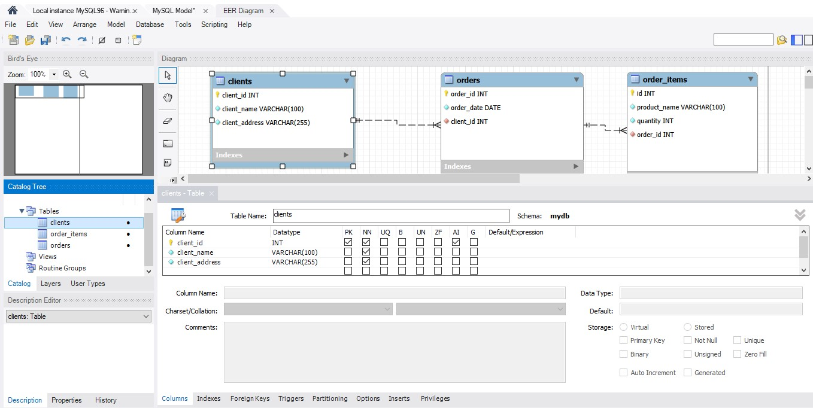

# goit-rdb-hw-02
Relational Databases Homework 02 — normalization (1NF, 2NF, 3NF) with MySQL Workbench diagrams
## 1NF Schema

Initial table normalized to First Normal Form (1NF): atomic values, no repeating groups.
## 2NF Schema

Data split into related tables to eliminate partial dependencies.
